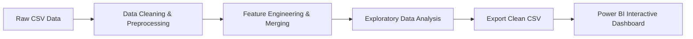

#  Superstore Sales Data Analysis 2026

<p align="center">
  
  
  
  
</p>

---

> 🚀 **An end-to-end Data Analytics solution** focused on raw data cleaning, exploratory data analysis (EDA), automated visualizations, and interactive Power BI dashboarding.

---

## 👨‍💻 Project Team

<table>
  <tr>
    <td align="center"><b>Vedant Kanhe</b></td>
    <td align="center"><b>Kunal Kachare</b></td>
    <td align="center"><b>Mahesh Shivankhede</b></td>
    <td align="center"><b>Aditya Khanapure</b></td>
  </tr>
</table>

---

## 📊 Executive Summary

This project transforms messy, uncleaned retail sales dataset into structured business intelligence reports. Using **Python** (`pandas`, `numpy`, `matplotlib`, `seaborn`) and **Power BI**, the raw data undergoes rigorous cleaning, deduplication, feature engineering, and statistical visual plotting.

---

## 🛠️ Tech Stack & Key Libraries

| Technology / Library | Purpose |
| :--- | :--- |
|  **Python** | Primary Programming Language |
|  **Pandas** | Data Manipulation & Cleaning |
|  **NumPy** | Numerical Computations |
| 📊 **Matplotlib & Seaborn** | Statistical Visualizations & Custom Charts |
| 📈 **Power BI** | Business Intelligence & Interactive Dashboarding |

---

## 📂 Repository Structure

```text
DATA_ANALYSIS_PROJECT_2026/
│
├── 📂 CSV DATA/
│   └── sales_raw_data.csv          # Raw CSV containing duplicate & null values
│
├── 📂 REPORT/
│   ├── cleaned_sales_data.csv      # Processed & cleaned sales data
│   └── powerbi_dashboard.pbix      # Power BI charts & interactive dashboard
│
├── 📂 PYTHON DATA/
│   ├── source_code/                # All Python analysis scripts & notebooks
│   └── output_charts/              # Visualizations saved from Seaborn & Matplotlib
│
└── 📄 README.md                       # Project documentation & execution guide
```

---

## ⚙️ Step-by-Step Implementation Workflow



### 🔹 Detailed Steps:
1. **Library Importation:** Loaded core data processing modules (`pandas`, `numpy`, `matplotlib`, `seaborn`).
2. **Data Ingestion:** Streamed raw sales dataset into Pandas DataFrames.
3. **Data Preprocessing & Cleaning:** Filtered duplicate values, filled/dropped missing `NaN` values, and reformatted column types.
4. **Feature Engineering:** Derived new performance metrics (e.g., Profit Margin %, Order Value buckets) from base fields.
5. **Data Merging & Aggregation:** Combined relational tables to consolidate multi-dimensional sales trends.
6. **Exploratory Visualizations:** Constructed comprehensive visual distributions:
   - 📊 **Bar & Line Charts:** Sales trends across months & quarters.
   - 🥧 **Pie Charts:** Region and Category share breakdowns.
   - 📈 **Histograms & Scatter Plots:** Price elasticity & sales-profit correlations.
   - 📦 **Box Plots:** Identifying price & quantity outliers.
7. **Enhanced Seaborn Styling:** Configured custom color palettes and grid themes for high-resolution chart exports.
8. **Automated Export:** Programmatically stored clean datasets and PNG charts for downstream reporting.
9. **Power BI Dashboard Creation:** Designed interactive slicers, KPIs, and executive reporting views.
10. **Code Optimization & Documentation:** Standardized code structure with inline documentation for reproducibility.

---

## 💡 Key Highlights & Deliverables

- 🧹 **Cleaned Dataset:** Zero missing/null values, formatted schema ready for analytics.
- 🎨 **Visual Output Gallery:** Seaborn visual plots exported in high resolution.
- 📊 **Power BI Dashboard:** Interactive dashboard showcasing key business KPIs.

---

<p align="center">
  <b>⭐ If you like this project, feel free to give it a star! ⭐</b><br>
  <i>Thank You for visiting!</i>
</p>
